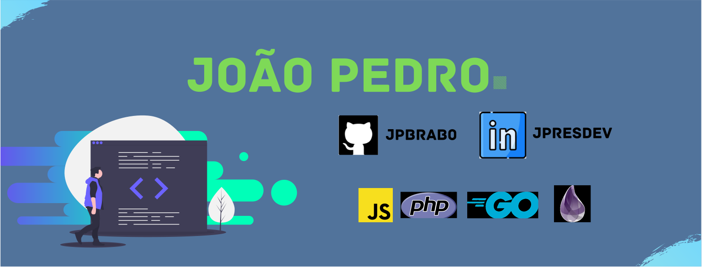

<table>
    <tr>
        <td></td>
        <td></td>
    </tr>   
</table>

## Seja bem-vindo ao meu Github! </h2>
---
Atualmente sou Web Developer, e atuo na área desde o começo de 2020.

Recentemente comecei a estudar o desenvolvimento backend e utilizo na maioria dos meus projetos.

## Tecnologias🖥️

    
    
    
    
    
    
    
    
    
    
    
    

* ### Informações:

    * 🇧🇷 Sou brasileiro;

    * 🙋‍♂️ Tenho 13 anos;

    * 📺 Live coding em [twitch.tv/jpbrab0](https://twitch.tv/jpbrab0)!

    * 🧑‍🎓 Também escrevo artigos sobre tecnologia no [dev.to](https://dev.to/jpbrab0/)!

<a href="https://www.linkedin.com/in/jpresdev"></img></a> [LinkedIn](https://www.linkedin.com/in/jpresdev)
 
<a href="https://twitch.tv/jpbrab0"></img></a> [Twitch](https://twitch.tv/jpbrab0)
 
<a href="https://twitter.com/jpbrab0"></img></a> [Twitter](https://twitter.com/jpbrab0)

